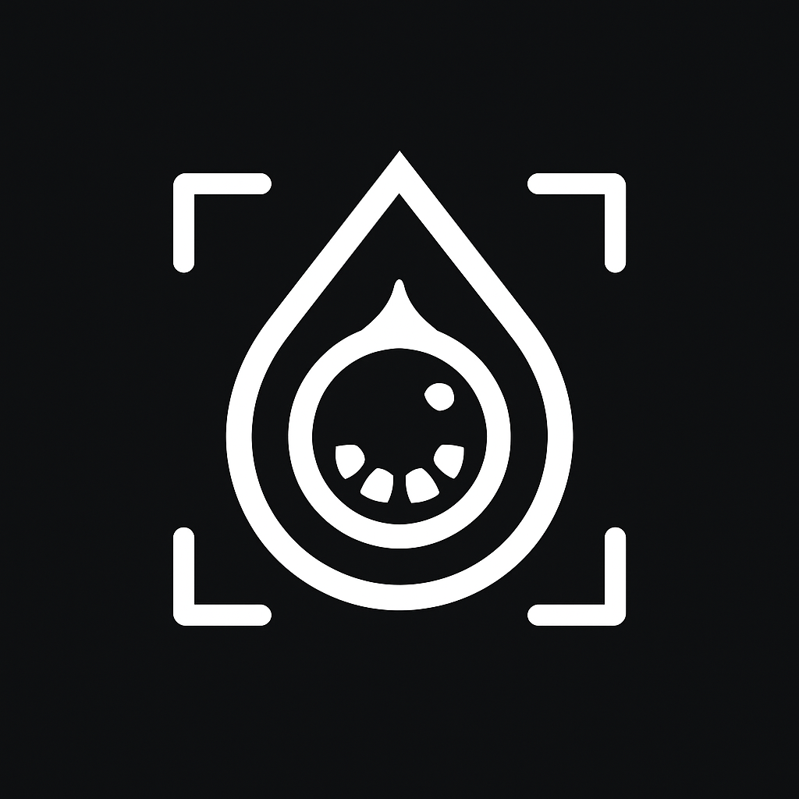

# HEXplorer - Detector de Cores Inteligente

<div align="center">
  
  
  <h1>HEXplorer</h1>
  <p><strong>Transforme o mundo real em paletas de cores profissionais</strong></p>
  
  <!-- Badges principais -->
  <a href="https://flutter.dev/"></a>
  <a href="https://dart.dev/"></a>
  <a href="https://pub.dev/packages/camera"></a>
  <a href="https://pub.dev/packages/sqflite"></a>
  
  <!-- Badges de funcionalidades -->
  <a href="#funcionalidades"></a>
  <a href="#tecnologias"></a>
  
  <!-- Badges de status -->
  <a href="#status"></a>
  <a href="#versão"></a>
  <a href="#licença"></a>

  <a href="https://www.mediafire.com/file/p25codmeyvnlv0s/HEXplorer-release.apk/file">
  
  </a>
</div>

---

## Índice

- [Download](#download)
- [Sobre o Projeto](#sobre-o-projeto)
- [Funcionalidades](#funcionalidades)
- [Arquitetura](#arquitetura)
- [Estrutura de Dados](#estrutura-de-dados)
- [Tecnologias](#tecnologias)
- [Como Executar](#como-executar)
- [Documentação Técnica](#documentação-técnica)
- [Contribuindo](#contribuindo)
- [Licença](#licença)

---

## Download

Você pode baixar a versão mais recente do **HEXplorer (APK Release)** pelo link abaixo:

👉 [Download HEXplorer - Release APK](https://www.mediafire.com/file/p25codmeyvnlv0s/HEXplorer-release.apk/file)

---

## Sobre o Projeto

**HEXplorer** é um aplicativo móvel desenvolvido em Flutter que **transforma o mundo real em paletas de cores profissionais**. O app captura cores do ambiente através da câmera ou galeria, analisa suas características psicológicas e gera paletas criativas automaticamente.

### Propósito
- **Designers e Artistas**: Capturar cores do mundo real para projetos
- **Pessoas com Daltonismo**: Entender como cores aparecem para outras pessoas
- **Entusiastas**: Descobrir significados das cores no ambiente

### Problema que Resolve
- Dificuldade em capturar cores do mundo real para projetos
- Falta de inspiração cromática em momentos criativos
- Necessidade de paletas harmoniosas rapidamente
- Análise psicológica das cores para projetos específicos

---

## Funcionalidades

### **Detecção de Cores**
- **Captura por Câmera**: Foto em tempo real com alta resolução
- **Seleção da Galeria**: Imagem existente do dispositivo
- **Processamento Otimizado**: Redimensionamento inteligente (200x200px)
- **Extração de Paleta**: Até 8 cores mais significativas

### **Análise Psicológica**
- **Sistema HSL**: Análise por matiz, saturação e luminosidade
- **Significados Dinâmicos**: Baseados nas características da cor
- **Categorização Inteligente**: 12 faixas de cores principais
- **Análise Detalhada**: Significados específicos por saturação e luminosidade

### **Simulação de Daltonismo**
- **Protanopia**: Dificuldade com vermelho/verde
- **Deuteranopia**: Dificuldade com vermelho/verde (diferente)
- **Tritanopia**: Dificuldade com azul/amarelo
- **Achromatopsia**: Visão monocromática
- **Visualização em Tempo Real**: Aplicação instantânea

### **Geração de Paletas**
- **Tons**: 4 variações de luminosidade da cor principal
- **Paleta Sugerida**: Cor principal + cores análogas + tom mais claro
- **Cores Complementares**: Opostas no círculo cromático (180°)
- **Cores Análogas**: Vizinhas no círculo cromático (±30°, ±60°)
- **Tríade**: 3 cores equidistantes (120° de diferença)

### **Persistência e Compartilhamento**
- **Armazenamento Local**: SQLite com suporte multiplataforma
- **Histórico Completo**: Todas as cores detectadas
- **Exportação XML**: Paletas em formato XML
- **Compartilhamento**: Integração com apps do sistema

---

## Arquitetura

### **Estrutura de Pastas**
```
detectordecores/
├── lib/                          # Código fonte principal
│   ├── main.dart                 # Ponto de entrada
│   ├── screens/                  # Telas da aplicação
│   │   ├── splash_screen.dart    # Tela de inicialização
│   │   ├── teladeteccao.dart     # Tela principal de detecção
│   │   ├── tela_detalhe_cor.dart # Tela de detalhes da cor
│   │   └── TelaSimulacaoDaltonismoFoto.dart # Simulação de daltonismo
│   ├── model/                    # Modelos de dados
│   │   └── cordetectadamodel.dart # Modelo de cor detectada
│   ├── dao/                      # Data Access Object
│   │   └── cordao.dart           # Operações de banco de dados
│   └── database/                 # Configuração do banco
│       └── db.dart               # Configuração SQLite
├── assets/                       # Recursos estáticos
│   └── img/                      # Imagens
│        └── logoHEXplorer.png     # Logo do app
├── android/                      # Configurações Android
├── ios/                          # Configurações iOS
├── web/                          # Configurações Web
├── windows/                      # Configurações Windows
├── macos/                        # Configurações macOS
├── linux/                        # Configurações Linux
├── test/                         # Testes
└── pubspec.yaml                  # Dependências e configurações
```

### **Fluxo de Dados**
```
Câmera/Galeria → Processamento → Análise HSL → Paletas → Banco de Dados
     ↓              ↓              ↓           ↓           ↓
  Captura      Redimensionamento  Significados  Geração   Persistência
```

---

## Estrutura de Dados

### **Modelo Principal - CorDetectadaModel**
```dart
class CorDetectadaModel {
  int? id;                                    // ID único (auto-incremento)
  String nomeCor;                             // Nome personalizado da cor
  String hexCor;                              // Código hexadecimal da cor
  String? imagemPath;                         // Caminho da imagem salva
  List<Map<String, String>> coresSignificativas; // Lista de cores relacionadas
  String? dataDetectada;                      // Data e hora da detecção
}
```

### **Estrutura do Banco de Dados**
```sql
CREATE TABLE cores_detectadas (
  id INTEGER PRIMARY KEY AUTOINCREMENT,      -- ID único
  nome_cor TEXT NOT NULL,                     -- Nome da cor
  hex_cor TEXT NOT NULL,                      -- Código hexadecimal
  imagem_path TEXT,                           -- Caminho da imagem
  cores_significativas TEXT,                  -- Cores relacionadas (JSON)
  data_detectada TEXT                         -- Data/hora da detecção
);
```

### **Campos Detalhados**

| Campo | Tipo | Descrição | Exemplo |
|-------|------|-----------|---------|
| `id` | `int` | Identificador único | `1` |
| `nomeCor` | `String` | Nome personalizado | `"Vermelho Vibrante"` |
| `hexCor` | `String` | Código hexadecimal | `"#FF0000"` |
| `imagemPath` | `String?` | Caminho da imagem | `"/app/documents/123456.jpg"` |
| `coresSignificativas` | `List<Map>` | Cores relacionadas | `[{"hex": "#FF0000"}, {"hex": "#CC0000"}]` |
| `dataDetectada` | `String` | Data/hora | `"25/12/2024 14:30"` |

---

## Tecnologias

### **Dependências Principais**
```yaml
dependencies:
  flutter:
    sdk: flutter
  cupertino_icons: ^1.0.8          # Ícones iOS
  sqflite: ^2.4.1                  # Banco de dados SQLite
  path: ^1.8.3                     # Manipulação de caminhos
  sqflite_common_ffi: ^2.3.5       # SQLite para desktop
  camera: ^0.10.5+9                # Captura de câmera
  image: ^4.1.7                    # Processamento de imagem
  path_provider: ^2.0.15           # Gerenciamento de arquivos
  palette_generator: ^0.3.3        # Geração de paletas
  google_fonts: ^6.2.1             # Tipografia Google Fonts
  image_picker: ^1.1.2             # Seleção de imagens da galeria
  converter: 0.4.0                 # Conversão de cores
  share_plus: ^7.0.0               # Compartilhamento de arquivos
  color_blindness: ^0.2.0          # Simulação de daltonismo
```

### **Funcionalidades das Bibliotecas**

| Biblioteca | Versão | Função |
|------------|--------|--------|
| **camera** | `^0.10.5+9` | Captura de fotos em alta resolução |
| **palette_generator** | `^0.3.3` | Extração automática de cores dominantes |
| **image** | `^4.1.7` | Processamento e redimensionamento de imagens |
| **sqflite** | `^2.4.1` | Persistência local de dados |
| **google_fonts** | `^6.2.1` | Tipografia Montserrat |
| **color_blindness** | `^0.2.0` | Simulação de daltonismo |

---

## Como Executar

### **Pré-requisitos**
- Flutter SDK 3.7.0+
- Dart SDK 3.0.0+
- Android Studio / VS Code
- Git

### **Passos para Execução**

1. **Clone o repositório**
   ```bash
   git clone https://github.com/seu-usuario/hexplorer.git
   cd hexplorer/detectordecores
   ```

2. **Instale as dependências**
   ```bash
   flutter pub get
   ```

3. **Execute o app**
   ```bash
   flutter run
   ```

### **Build para Produção**

#### Android
```bash
flutter build apk --release
```

#### iOS
```bash
flutter build ios --release
```

#### Windows
```bash
flutter build windows --release
```

---

## Documentação Técnica

### **Algoritmo de Detecção de Cores**

1. **Captura da Imagem**: Foto em alta resolução
2. **Redimensionamento**: 200x200px para otimização
3. **Geração de Paleta**: PaletteGenerator com máximo 20 cores
4. **Ordenação**: Por saturação × população de pixels
5. **Seleção**: 8 cores mais significativas

### **Análise HSL**

```dart
String _getSignificadoPorHSL(Color cor) {
  final hsl = HSLColor.fromColor(cor);
  final hue = hsl.hue;           // Matiz (0-360°)
  final saturation = hsl.saturation; // Saturação (0-1)
  final lightness = hsl.lightness;   // Luminosidade (0-1)
  
  // Análise por luminosidade
  if (lightness < 0.15) return 'Poder absoluto, elegância sofisticada...';
  if (lightness > 0.85) return 'Pureza absoluta, paz interior...';
  
  // Análise por matiz com saturação
  if (hue >= 0 && hue < 30) { // Vermelhos
    if (saturation < 0.4) return 'Paixão suave e introspectiva...';
    // ... continua para outras faixas
  }
}
```

### **Simulação de Daltonismo**

```dart
// Matrizes de transformação
final List<double> _protanopiaMatrix = [
  0.20, 0.80, 0.00, 0, 0,
  0.20, 0.80, 0.00, 0, 0,
  0.00, 0.20, 0.80, 0, 0,
  0,    0,    0,    1, 0,
];
```

### **Geração de Paletas**

- **Tons**: Variações de luminosidade (±20%, ±40%, ±60%)
- **Complementares**: 180° no círculo cromático
- **Análogas**: ±30° e ±60° no círculo cromático
- **Tríade**: 120° de diferença entre cores

---

## Contribuindo

### **Como Contribuir**

1. **Fork o projeto**
2. **Crie uma branch** (`git checkout -b feature/AmazingFeature`)
3. **Commit suas mudanças** (`git commit -m 'Add some AmazingFeature'`)
4. **Push para a branch** (`git push origin feature/AmazingFeature`)
5. **Abra um Pull Request**

### **Reportando Bugs**

- Use o template de issue
- Inclua screenshots se aplicável
- Descreva os passos para reproduzir
- Especifique a plataforma e versão

### **Sugestões de Melhorias**

- Descreva a funcionalidade desejada
- Explique o benefício para os usuários
- Inclua mockups se possível

---

## Contato

- **Desenvolvedor**: [Pedro Zucchi](https://github.com/pedro-zucchi90)
- **Email**: pedrozucchi2008@gmail.com
- **LinkedIn**: [Pedro Zucchi](https://www.linkedin.com/in/pedro-zucchi-52b50132b/)


