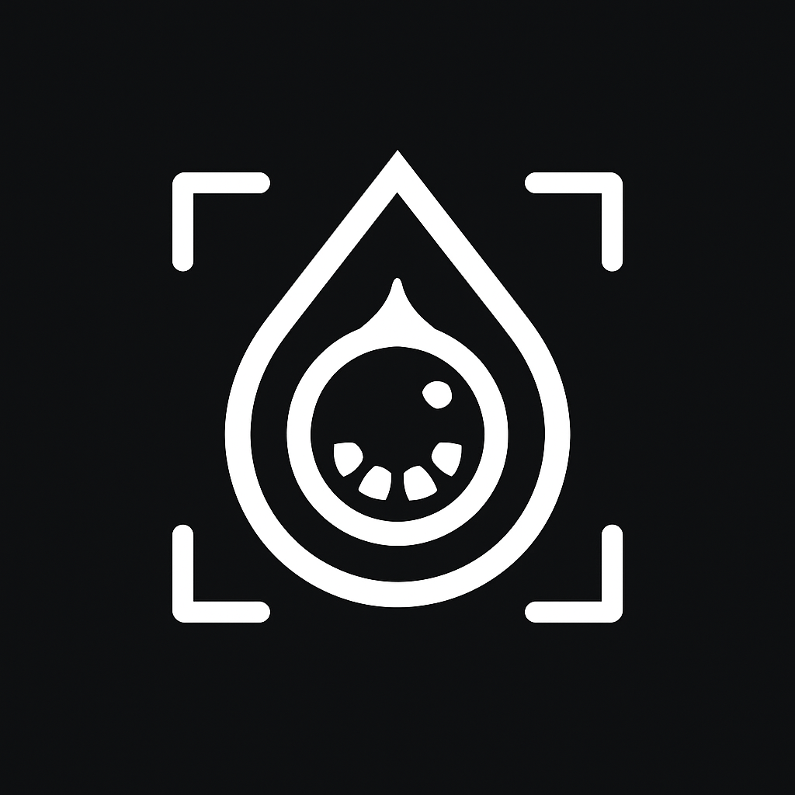

# HEXplorer - Intelligent Color Detector

<div align="center">
  
  
  <h1>HEXplorer</h1>
  <p><strong>Transform the real world into professional color palettes</strong></p>
  
  <!-- Main badges -->
  <a href="https://flutter.dev/"></a>
  <a href="https://dart.dev/"></a>
  <a href="https://pub.dev/packages/camera"></a>
  <a href="https://pub.dev/packages/sqflite"></a>
  
  <!-- Feature badges -->
  <a href="#features"></a>
  <a href="#technologies"></a>
  
  <!-- Status badges -->
  <a href="#status"></a>
  <a href="#version"></a>
  <a href="#license"></a>

  <a href="https://www.mediafire.com/file/p25codmeyvnlv0s/HEXplorer-release.apk/file">
  
  </a>
</div>

---

## Table of Contents

- [Download](#download)
- [About the Project](#about-the-project)
- [Features](#features)
- [Architecture](#architecture)
- [Data Structure](#data-structure)
- [Technologies](#technologies)
- [How to Run](#how-to-run)
- [Technical Documentation](#technical-documentation)
- [Contributing](#contributing)
- [License](#license)

---

## Download

You can download the latest version of **HEXplorer (APK Release)** from the link below:

👉 [Download HEXplorer - Release APK](https://www.mediafire.com/file/p25codmeyvnlv0s/HEXplorer-release.apk/file)

---

## About the Project

**HEXplorer** is a mobile application developed in Flutter that **transforms the real world into professional color palettes**. The app captures colors from the environment through the camera or gallery, analyzes their psychological characteristics, and automatically generates creative palettes.

### Purpose
- **Designers and Artists**: Capture colors from the real world for projects
- **People with Color Blindness**: Understand how colors appear to others
- **Enthusiasts**: Discover color meanings in the environment

### Problem it Solves
- Difficulty capturing colors from the real world for projects
- Lack of chromatic inspiration in creative moments
- Need for harmonious palettes quickly
- Psychological analysis of colors for specific projects

---

## Features

### **Color Detection**
- **Camera Capture**: Real-time high-resolution photo
- **Gallery Selection**: Existing image from device
- **Optimized Processing**: Intelligent resizing (200x200px)
- **Palette Extraction**: Up to 8 most significant colors

### **Psychological Analysis**
- **HSL System**: Analysis by hue, saturation, and lightness
- **Dynamic Meanings**: Based on color characteristics
- **Intelligent Categorization**: 12 main color ranges
- **Detailed Analysis**: Specific meanings by saturation and lightness

### **Color Blindness Simulation**
- **Protanopia**: Difficulty with red/green
- **Deuteranopia**: Difficulty with red/green (different)
- **Tritanopia**: Difficulty with blue/yellow
- **Achromatopsia**: Monochromatic vision
- **Real-Time Visualization**: Instant application

### **Palette Generation**
- **Shades**: 4 lightness variations of the main color
- **Suggested Palette**: Main color + analogous colors + lightest shade
- **Complementary Colors**: Opposite on the color wheel (180°)
- **Analogous Colors**: Neighbors on the color wheel (±30°, ±60°)
- **Triad**: 3 equidistant colors (120° difference)

### **Persistence and Sharing**
- **Local Storage**: SQLite with cross-platform support
- **Complete History**: All detected colors
- **XML Export**: Palettes in XML format
- **Sharing**: Integration with system apps

---

## Architecture

### **Folder Structure**
```
detectordecores/
├── lib/                          # Main source code
│   ├── main.dart                 # Entry point
│   ├── screens/                  # Application screens
│   │   ├── splash_screen.dart    # Splash screen
│   │   ├── teladeteccao.dart     # Main detection screen
│   │   ├── tela_detalhe_cor.dart # Color detail screen
│   │   └── TelaSimulacaoDaltonismoFoto.dart # Color blindness simulation
│   ├── model/                    # Data models
│   │   └── cordetectadamodel.dart # Detected color model
│   ├── dao/                      # Data Access Object
│   │   └── cordao.dart           # Database operations
│   └── database/                 # Database configuration
│       └── db.dart               # SQLite configuration
├── assets/                       # Static resources
│   └── img/                      # Images
│        └── logoHEXplorer.png     # App logo
├── android/                      # Android configuration
├── ios/                          # iOS configuration
├── web/                          # Web configuration
├── windows/                      # Windows configuration
├── macos/                        # macOS configuration
├── linux/                        # Linux configuration
├── test/                         # Tests
└── pubspec.yaml                  # Dependencies and configuration
```

### **Data Flow**
```
Camera/Gallery → Processing → HSL Analysis → Palettes → Database
     ↓              ↓              ↓           ↓           ↓
  Capture       Resizing       Meanings    Generation  Persistence
```

---

## Data Structure

### **Main Model - CorDetectadaModel**
```
class CorDetectadaModel {
  int? id;                                    // Unique ID (auto-increment)
  String nomeCor;                             // Custom color name
  String hexCor;                              // Color hexadecimal code
  String? imagemPath;                         // Saved image path
  List<Map<String, String>> coresSignificativas; // Related colors list
  String? dataDetectada;                      // Detection date and time
}
```

### **Database Structure**
```
CREATE TABLE cores_detectadas (
  id INTEGER PRIMARY KEY AUTOINCREMENT,      -- Unique ID
  nome_cor TEXT NOT NULL,                     -- Color name
  hex_cor TEXT NOT NULL,                      -- Hexadecimal code
  imagem_path TEXT,                           -- Image path
  cores_significativas TEXT,                  -- Related colors (JSON)
  data_detectada TEXT                         -- Detection date/time
);
```

### **Detailed Fields**

| Field | Type | Description | Example |
|-------|------|-------------|---------|
| `id` | `int` | Unique identifier | `1` |
| `nomeCor` | `String` | Custom name | `"Vibrant Red"` |
| `hexCor` | `String` | Hexadecimal code | `"#FF0000"` |
| `imagemPath` | `String?` | Image path | `"/app/documents/123456.jpg"` |
| `coresSignificativas` | `List<Map>` | Related colors | `[{"hex": "#FF0000"}, {"hex": "#CC0000"}]` |
| `dataDetectada` | `String` | Date/time | `"12/25/2024 2:30 PM"` |

---

## Technologies

### **Main Dependencies**
```
dependencies:
  flutter:
    sdk: flutter
  cupertino_icons: ^1.0.8          # iOS icons
  sqflite: ^2.4.1                  # SQLite database
  path: ^1.8.3                     # Path manipulation
  sqflite_common_ffi: ^2.3.5       # SQLite for desktop
  camera: ^0.10.5+9                # Camera capture
  image: ^4.1.7                    # Image processing
  path_provider: ^2.0.15           # File management
  palette_generator: ^0.3.3        # Palette generation
  google_fonts: ^6.2.1             # Google Fonts typography
  image_picker: ^1.1.2             # Gallery image selection
  converter: 0.4.0                 # Color conversion
  share_plus: ^7.0.0               # File sharing
  color_blindness: ^0.2.0          # Color blindness simulation
```

### **Library Functionalities**

| Library | Version | Function |
|---------|---------|----------|
| **camera** | `^0.10.5+9` | High-resolution photo capture |
| **palette_generator** | `^0.3.3` | Automatic extraction of dominant colors |
| **image** | `^4.1.7` | Image processing and resizing |
| **sqflite** | `^2.4.1` | Local data persistence |
| **google_fonts** | `^6.2.1` | Montserrat typography |
| **color_blindness** | `^0.2.0` | Color blindness simulation |

---

## How to Run

### **Prerequisites**
- Flutter SDK 3.7.0+
- Dart SDK 3.0.0+
- Android Studio / VS Code
- Git

### **Steps to Run**

1. **Clone the repository**
   ```
   git clone https://github.com/your-username/hexplorer.git
   cd hexplorer/detectordecores
   ```

2. **Install dependencies**
   ```
   flutter pub get
   ```

3. **Run the app**
   ```
   flutter run
   ```

### **Production Build**

#### Android
```
flutter build apk --release
```

#### iOS
```
flutter build ios --release
```

#### Windows
```
flutter build windows --release
```

---

## Technical Documentation

### **Color Detection Algorithm**

1. **Image Capture**: High-resolution photo
2. **Resizing**: 200x200px for optimization
3. **Palette Generation**: PaletteGenerator with maximum 20 colors
4. **Sorting**: By saturation × pixel population
5. **Selection**: 8 most significant colors

### **HSL Analysis**

```
String _getSignificadoPorHSL(Color cor) {
  final hsl = HSLColor.fromColor(cor);
  final hue = hsl.hue;           // Hue (0-360°)
  final saturation = hsl.saturation; // Saturation (0-1)
  final lightness = hsl.lightness;   // Lightness (0-1)
  
  // Analysis by lightness
  if (lightness < 0.15) return 'Absolute power, sophisticated elegance...';
  if (lightness > 0.85) return 'Absolute purity, inner peace...';
  
  // Analysis by hue with saturation
  if (hue >= 0 && hue < 30) { // Reds
    if (saturation < 0.4) return 'Soft and introspective passion...';
    // ... continues for other ranges
  }
}
```

### **Color Blindness Simulation**

```
// Transformation matrices
final List<double> _protanopiaMatrix = [
  0.20, 0.80, 0.00, 0, 0,
  0.20, 0.80, 0.00, 0, 0,
  0.00, 0.20, 0.80, 0, 0,
  0,    0,    0,    1, 0,
];
```

### **Palette Generation**

- **Shades**: Lightness variations (±20%, ±40%, ±60%)
- **Complementary**: 180° on the color wheel
- **Analogous**: ±30° and ±60° on the color wheel
- **Triad**: 120° difference between colors

---

## Contributing

### **How to Contribute**

1. **Fork the project**
2. **Create a branch** (`git checkout -b feature/AmazingFeature`)
3. **Commit your changes** (`git commit -m 'Add some AmazingFeature'`)
4. **Push to the branch** (`git push origin feature/AmazingFeature`)
5. **Open a Pull Request**

### **Reporting Bugs**

- Use the issue template
- Include screenshots if applicable
- Describe steps to reproduce
- Specify platform and version

### **Improvement Suggestions**

- Describe the desired functionality
- Explain the benefit to users
- Include mockups if possible

---

## Contact

- **Developer**: [Pedro Zucchi](https://github.com/pedro-zucchi90)
- **Email**: [pedro@zucchi.dev.br](mailto:pedro@zucchi.dev.br)
- **LinkedIn**: [Pedro Zucchi](https://www.linkedin.com/in/pedro-zucchi-52b50132b/)
